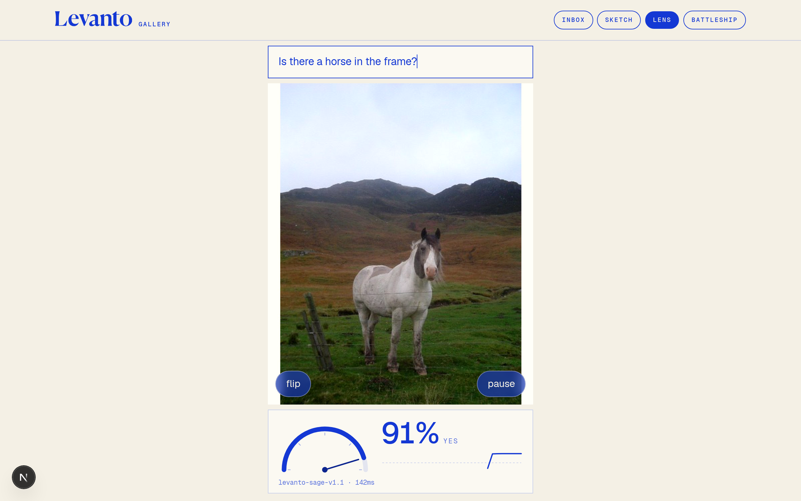

# Levanto Lens

Point the camera at something, type a yes/no question, and watch the odds. Once a
second a frame goes to [Levanto Sage](https://sage.levanto.ai) as an image with
your question, and the probability is the display: a big number, a needle that
eases toward it, and a sparkline of the last thirty seconds. Nothing else.



## What this shows

One yes/no decision on one image, repeated. "Is the door open?" "Is someone
holding a mug?" "Is the kettle on?" The question is the instruction, the frame
is the document, and the number on screen is Sage's probability, not a
thresholded label. Open the door and the needle swings.

## What this does not show

Calibration or measurement. A probability is Sage's read of one frame, not a
measurement. Answers vary a little between frames of the same scene, and
anything outside the frame is not inferred. Nothing is stored: no history
beyond the sparkline, no accounts, no scoring.

## The one decision

```
document:    { kind: "image", media: <jpeg data URI, 512px long edge, q0.7>,
               text: "A live camera frame. Answer only from what is visible in this frame." }
question:    yesno, instructions = whatever you typed (1..120 chars)
reasoning:   off
```

The route is `POST /api/ask` with `{ question, image }` and returns
`{ answer, probability, meta: { model, latencyMs } }`. A null answer (Sage
unsure) is shown as 50% and "unsure".

## Running it

Lens is one tab of the Sage gallery. From the repo root:

    npm install
    echo "LEVANTO_API_KEY=lv_live_..." > .env.local
    npm run dev        # http://localhost:3000/lens

`npm test` runs every tab's unit tests; Lens's are in `test/` (no network,
camera and canvas stubbed).

## On a phone

Camera access needs a secure context. `localhost` counts on a desktop, but a
phone hitting your laptop over the LAN does not, so for mobile either deploy
(Vercel with `LEVANTO_API_KEY` set) or tunnel `npm run dev` over HTTPS. The page
asks for the rear camera first (`facingMode: environment`) and falls back to any
camera; the flip button switches. The layout is full height with no page
scroll; the question sits at the top, the video fills the middle, the readout
sits under it. Verified in Chromium at 390x844 with touch emulation.

## Layout

- `lib/session.ts`: the pure state machine (idle, running, paused, error),
  stale-response dropping by sequence number, thirty-reading history.
- `lib/frame.ts`: frame sizing, needle angle, sparkline points.
- `lib/validate.ts`: request body checks.
- `src/app/api/ask/route.ts` (repo root): the one endpoint; the key never reaches the browser.
- `components/Lens.tsx`: camera, the once-a-second loop (one request in
  flight at a time, 900 ms minimum interval), the readout.
- `components/Gauge.tsx`, `Sparkline.tsx`: SVG, no chart library.
- The tab's page is `src/app/lens/page.tsx` at the repo root; the shell provides the nav and layout.

## Known limits

- The first call after idle can take up to ~90 s while Sage scales from zero;
  the readout says "waking Sage up" after five seconds.
- One frame per second is the loop's ceiling by design, and each frame is one
  billed decision plus one image unit.
- Changing the question applies from the next frame; there is no debounce, so
  a half-typed question gets asked once.
- Simplifications chosen without asking: the video is `object-cover` (edges are
  cropped on screen, but the frame sent to Sage is the full sensor frame); the
  default question is "Is someone in the frame?"; a transient request error
  shows in the footer and the loop keeps going.
